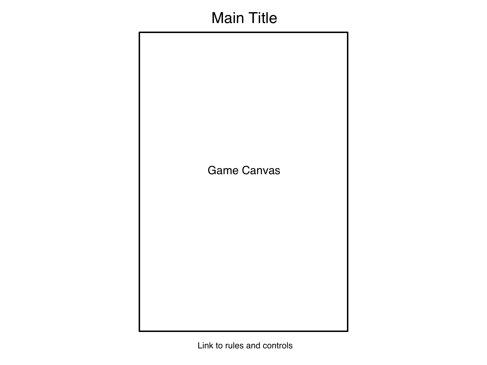

# Polychaete

## Background

Polychaete (pronounced "polykeet") is a Centipede-inspired arcade-style game.  The player's character can move within the bottom area of the screen, while a polychaete (a type of sea worm) starts at the top of the screen, moving back and forth and descending one row each time it hits a side or sea sponge.  The player can shoot to destroy the sea sponges or individual segments of the polychaete.  When the player destroys middle segments of a polychaete, it splits into two.  The player scores points based on the number of sea sponges and polychaeta (plural of polychaete) they destroy.

## Functionality & MVP

Users will be able to:

- [x] Start, pause, and reset the game
- [x] Move their character and fire at polychaeta and sea sponges
- [x] View their current score, as well as the (local) high score

In addition, this project will include:

- [x] An about modal explaining the rules and controls of the game
- [ ] A production README

## Wireframes

This app will consist of a single screen with the game board and a link to display the rules and controls modal.  All controls will be keyboard based.

## Architecture and Technologies

This project will be implemented with the following technologies:

 * Vanilla JavaScript
 * Easel.js with HTML Canvas for rendering the game canvas
 * Tone.js for in-game sounds
 * Webpack to bundle the various files and scripts

The following script files will be created:

 * `game_object.js` will be a base class from which on screen game objects will inherit, which enables tracking of position and movement.
 * `polychaete.js` will represent the polychaeta, including movement and splitting when shot by the player.
 * `sea_sponge.js` will represent the sea sponge objects.  
 * `player.js` will track the player character's position and handle their shooting ability.
 * `board.js` will handle the logic for creating, updating, and rendering the board state, as well as responding to user input.

## Implementation Timeline

**Day 1:** Set up project and render Polychaete, Sea Sponge, and Player to the Canvas.

**Day 2:** Implement player movement, shooting, and controls.

**Day 3:** Implement polychaete movement and splitting.

**Day 4:** Polish project, add sounds and additional levels as time allows.

## Bonus Features

- [ ] Add additional objects/characters
- [ ] Implement in-game music
- [ ] Allow player to choose from multiple board dimensions
